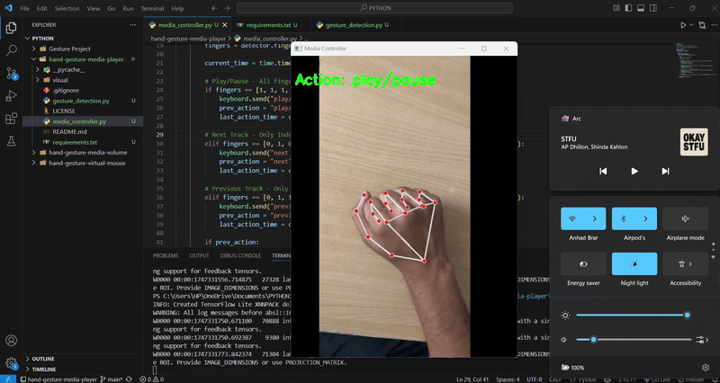

# 🎵 Hand Gesture Media Controller

Control media playback using your hand gestures with this Python-based project.

## 📦 Tech Stack
- Python
- OpenCV
- MediaPipe
- Keyboard (for simulating media keys)

## 🛠️ How It Works
- Detects hand using MediaPipe
- Recognizes gestures:
  - 🖐 Play/Pause
  - ☝ Next Track
  - 👍 Previous Track
- Sends system media keys via `keyboard` module

# DEMO


## 🚀 How to Run
```bash
pip install -r requirements.txt
python media_controller.py
```

## 🛑 How to stop
Just press key 'q'
